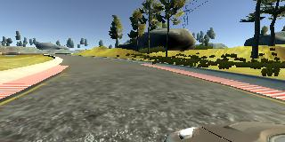
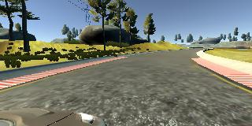

#**Behavioral Cloning for Self-Driving Cars** 

#***Writeup***
---

**Behavioral Cloning Project**

The goals / steps of this project are the following:

* Use the simulator to collect data of good driving behavior
* Build, a convolution neural network in Keras that predicts steering angles from images
* Train and validate the model with a training and validation set
* Test that the model successfully drives around track one without leaving the road
* Summarize the results with a written report


[//]: # (Image References)

[image1]: ./examples/placeholder.png "Model Visualization"
[image2]: ./examples/placeholder.png "Grayscaling"
[image3]: ./examples/placeholder_small.png "Recovery Image"
[image4]: ./examples/placeholder_small.png "Recovery Image"
[image5]: ./examples/placeholder_small.png "Recovery Image"
[image6]: ./examples/placeholder_small.png "Normal Image"
[image7]: ./examples/placeholder_small.png "Flipped Image"

## Rubric Points
###Here I will consider the [rubric points](https://review.udacity.com/#!/rubrics/432/view) individually and describe how I addressed each point in my implementation.  

---
###Files Submitted & Code Quality

####1. Submission includes all required files and can be used to run the simulator in autonomous mode

My project includes the following files:
* model.py containing the script to create and train the model
* drive.py for driving the car in autonomous mode
* model.h5 containing a trained convolution neural network 
* writeup_report.md or writeup_report.pdf summarizing the results

####2. Submission includes functional code
Using the Udacity provided simulator and my drive.py file, the car can be driven autonomously around the track by executing 
```sh
python drive.py model.h5
```

####3. Submitted code is usable and readable

The model.py file contains the code for training and saving the convolution neural network. The file shows the pipeline I used for training and validating the model, and it contains comments to explain how the code works.

###Model Architecture and Training Strategy

####1. An appropriate model architecture has been employed

My model is based on an artchitecture from the paper in [Nvidia paper](http://images.nvidia.com/content/tegra/automotive/images/2016/solutions/pdf/end-to-end-dl-using-px.pdf) . Normalised data is fed to a  series of 5 convolutional layers followed by 3 fully connected layers. In order to include nonlinearity RELU activations have been in used in each of the above layers.  

####2. Attempts to reduce overfitting in the model

In order to avoid overfitting varying degree of dropouts have been applied in each of the convoloutional and fully-connected layers. In addition the 50% of  the randomly chosen images were reflected and used to augment the data.  An example of flipped image is shown below.

***
Original Image             |  Flipped Image
:-------------------------:|:-------------------------:
  |  

####3. Model parameter tuning

The model used an adam optimizer, so the learning rate was not tuned manually.

####4. Appropriate training data

I attempted to collect data using the simulator. However the quality of the data was not high because of the difficulty I had controlling the vehicle.  Therfore, for training and valdation I opted to use the simulator data provided by [Udacity](https://d17h27t6h515a5.cloudfront.net/topher/2016/December/584f6edd_data/data.zip). 


###Model Architecture and Training Strategy

####1. Solution Design Approach


My first step was to use a convolution neural network without trimming the camera images. However the network was not generalising well and the vehicle ended up off track because of the background. However, after carefully selecting a camera window which redced the nackgornd noise the model was learing reasonably well. In order to overcome overfitting I augmented the data with images mirrored about a vertical plane. 


####2. Final Model Architecture

The final model architecture (model.py lines 18-24) consisted of a convolution neural network with the following layers and layer sizes:

* Normalize input of size 3X66X200
* Convolutional layer 1 of size 24X31x98 , 5x5 kernel, 2x2 stride 
* Convolutional layer 2 of size 36X14x47, 5x5 kernel, 2x2 stride 
* Convolutional layer 3 of size 48X5x22, 5x5 kernel, 2x2 stride 
* Convolutional layer 4 of size 64X3x20, 3x3 kernel, 1x1 stride 
* Convolutional layer 5 of size 64X1x18, 3x3 kernel, 1x1 stride 
* Flatten
* Fully-connected layer 1 of size 100 neurons 
* Fully-connected layer 2  of size 50 neurons 
* Fully-connected layer 3 of size 10 neurons
* Output layer


####3. Creation of the Training Set & Training Process

I found keeping the car at the center of the road very difficult. Hence the data I recorded by driving around was not of much use. For this reason I opted to use the smaple data provided by Udacity for track 1. Using the data the model trained successfully as evidenced my the autonmous driving video output.

Initilally I randomly shfuffled all of the dataset before splitting it so that 10% of the whole dataset is used for validation.
 
I used this training data for training the model. The validation set helped determine if the model was over or under fitting. The ideal number of epochs was 5 as evidenced by the fact that the validation loss didn't improve further. I used an adam optimizer so that manually training the learning rate wasn't necessary.

##References:
1. [Nvidia paper](http://images.nvidia.com/content/tegra/automotive/images/2016/solutions/pdf/end-to-end-dl-using-px.pdf) 
2. [Udacity driving data](https://d17h27t6h515a5.cloudfront.net/topher/2016/December/584f6edd_data/data.zip) 
